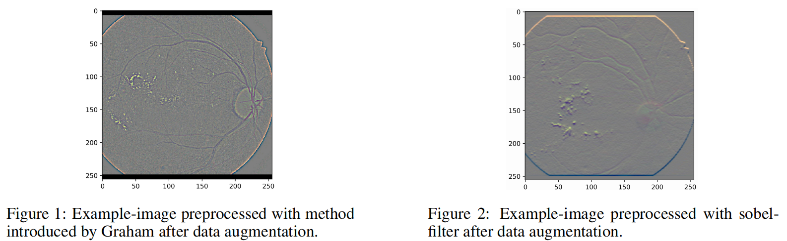

# DL-Lab
Deep learning Lab: 1. Diabetic Retinopathy Detection; 2. Human Activity Recognition

## Task-1
Diabetic Retinopathy Detection

**Preprocessing**

**Visualization**

## Task-2
Human Activity Recognition

**Poster**
